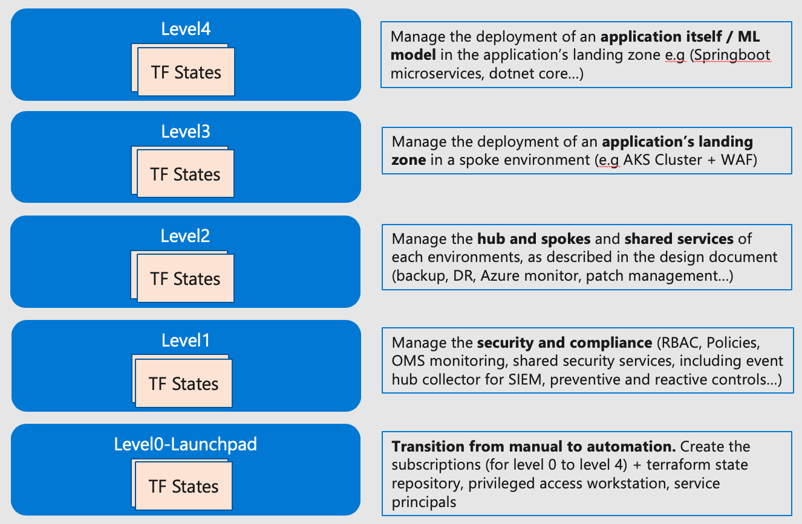

# Azure Cloud Adoption Framework landing zones guidance

In this series of articles, we describe the development, code architecture, the delivery mechanisms and operations guide for enterprise adoption of landing zones.

## Getting started

[Getting started on your laptop](./getting_started/getting_started.md)

[Getting started on Visual Studio CodeSpaces](./getting_started/getting_started_codespaces.md)

## Landing zones architecture

[Introduction to Azure landing zones architecture](./code_architecture/intro_architecture.md)

## Delivery of landing zones

[Introduction to delivery of landing zones](./delivery/delivery_landingzones.md)

Enjoy! 