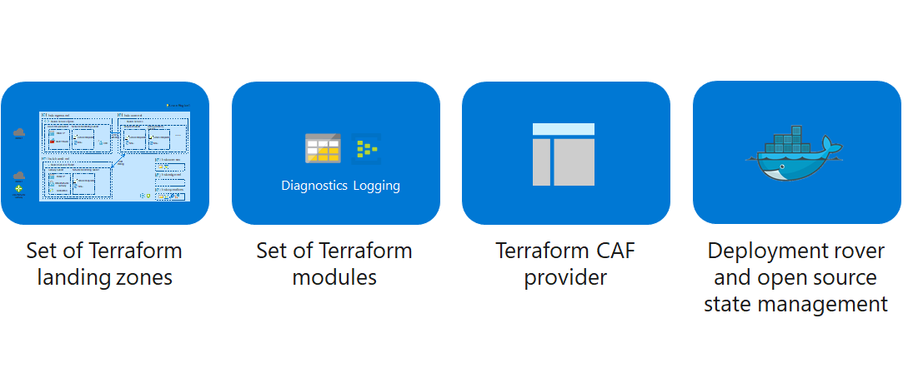
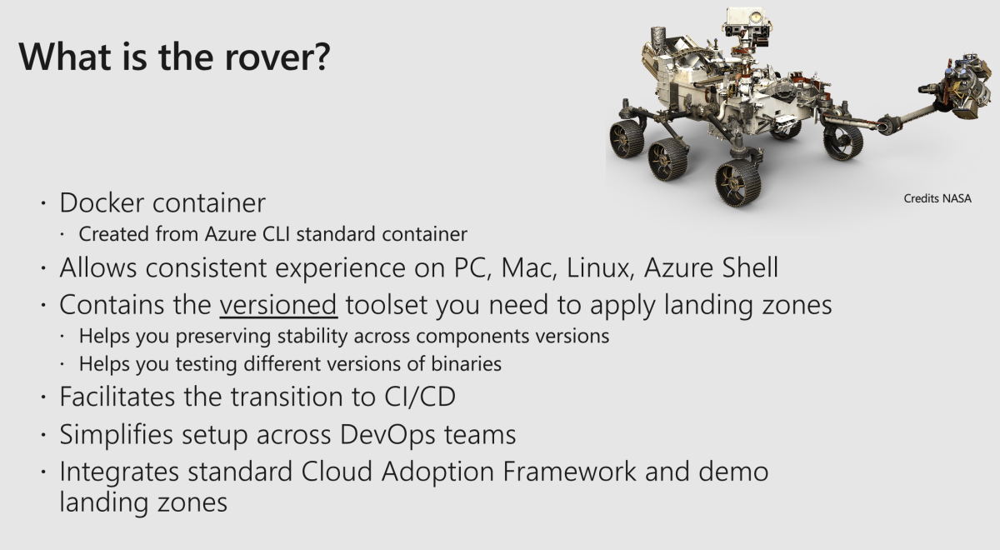
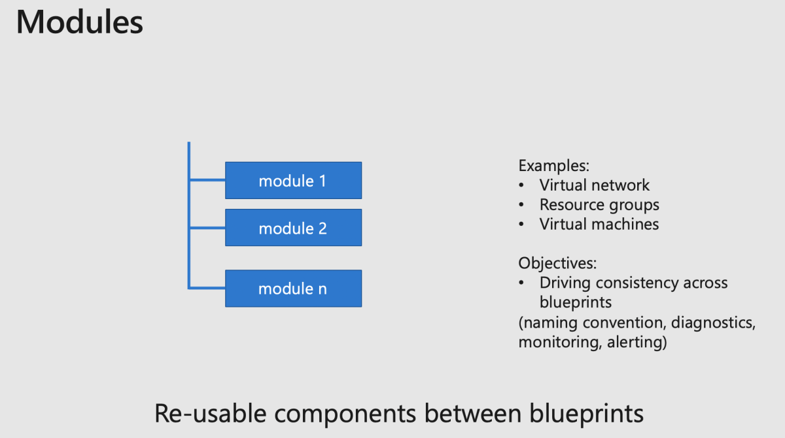
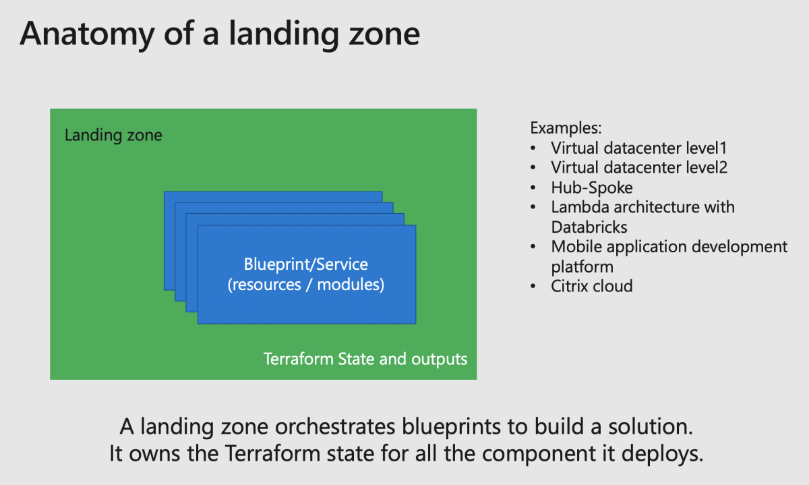

# Introduction to Azure landing zones components

Azure landing zones help you deploy a complete environment leveraging
the following elements:

## DevOps Toolset

In order to bootstrap an environment, we provide the following minimal DevOps components tools.

### rover

[Source here](https://github.com/aztfmod/rover)

The \"rover\" is part of the fundamental toolset of the Azure CAF landing zone model. The rover allows you to deploy all landing zones in a consistent and automated way:

* It is a Docker **container** running on all platforms transparently: Windows, Linux, Mac.
* Allows a validated **versioned** tool set.

Advantages of using the rover compared to running Terraform directly on your machine:

* Simplifies setup and configuration across DevOps teams: everyone works with the same versions of the tools.
* Abstracts and helps with the Terraform state management.
* Helps preserve stability across components versions.
* Helps testing different versions of binaries (new version of Terraform, Azure CLI, jq, tflint etc.)
* Facilitates the identity transition to any CI/CD.
* Allows easy transition from one DevOps environment to another (GitHub Actions, Azure DevOps, Jenkins, CircleCI etc.)

## Modules

[Source here](https://github.com/aztfmod/)

Cloud Adoption Framework maintains a set of curated modules. We mainly use module to enforce a consistent set of configuration settings and requirements.

Modules must have a strong versioning, in the CAF modules, we use semantic versioning, and all modules are published on the [Hashicorp Terraform registry](https://registry.terraform.io/modules/aztfmod)

## Landing zone

[Source here](https://github.com/aztfmod/landingzones)

A landing zone is a composition of multiple resources (modules, blueprints/services) that deliver a full application environment.

The landing zone is **responsible** for the **Terraform state** and will produce outputs that may be reused by other landing zones as follow:

A landing zone can contain subparts called blueprints, also called services, which are reusable sets of infrastructure components that have been assembled to deliver a service, for instance, an egress DMZ or a solution like Network Virtual Appliance from a third party vendor.

Blueprints/Services can be stored either inside the landing zones (as a subdirectory for instance) or re-used across landing zones while stored in another directory.

The delivery of a full landing zone might be decomposed in multiples levels in order to manage different personas and contain the blast radius that a mistake might incur in one landing zone.

### Launchpad
[Source here](https://github.com/Azure/caf-terraform-landingzones/tree/master/caf_launchpad)

The launchpad is a special landing zone and is the first landing zone you will create for your environment (**level 0**).
This landing zone acts as your toolbox to deploy the resources that in turn helps manage the fundamentals of a full landing zone deployment:

A level0 landing zone is the foundation of account and subscription management. As such it is responsible for:

* Defining how to store and retrieve the Terraform state.
* Defining the core of secrets protection for the Terraform state.
* Defining the management of the principals or identities for a complex environment.
* Defining how to access/partition the different subscriptions.
* Defining the DevOps foundations.
* Defining initial blueprints

Currently we support an open source version of [level0 launchpad](https://github.com/Azure/caf-terraform-landingzones/tree/master/caf_launchpad).

[Back to summary](../README.md)

