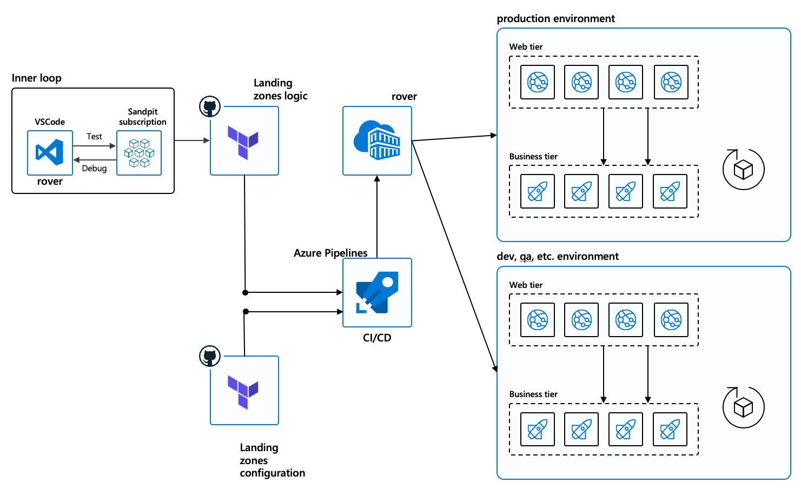

# Delivery model for landing zones

Cloud Adoption Framework for Azure landing zones for Terraform are to be delivered mainly by DevOps pipelines. The example below shows what could be an execution environment for DevOps using a combination of GitHub and Azure DevOps.

## DevOps components

The above model illustrates using both GitHub and Azure DevOps, but precisely because we are using the rover, it is relatively easy to pick your favorite enterprise toolset: Terraform Cloud/Enterprise, Jenkins, CircleCI, etc.

In greater detail we see the DevOps pipelines enforcing the landing
zones as below:

- **A inner feedback loop**:
Meant to provide very quick feedback to developers and DevOps engineers, offers the possibility to develop code, test it fast and iterate at fast pace.
- **DevOps pipelines enforcing the landing zones**:
A whole execution environment composed of pipelines executed in a customer environment.

- **Rover** is the DevOps toolchain that enables deployments as described [here](../code_architecture/intro_architecture.md).

We can distinguish two repositories for the environment:

- **Terraform scripts repositories**:  will be used to store and describe logic of Terraform deployments (the script and core code that will be executed)

- **Terraform configuration repositories**: will be used to store and describe the configuration of the environment and of the applications.
Different environments like PROD, DEV, UAT, etc. will be implemented using different configuration files inside the configuration repository.

The Azure pipelines will use Azure DevOps hosted agents to run the rover. We will be authenticated by Azure Active Directory with [Managed Identities](https://docs.microsoft.com/en-us/azure/active-directory/managed-identities-azure-resources/overview) of the DevOps self-hosted agents.

The deployment of the self-hosted DevOps agent is completed by the
launchpad\_opensource which will setup the agents and managed identities
as described in the previous chapter (landing zones hierarchy). One
Virtual Machine will be deployed per level and each Virtual Machine will
manage a few self-hosted agents depending on concurrent deployments
needs, in order to control privileges and reduce attack surface, we propose a hierarchy of pipelines that is described [here](../code_architecture/hierarchy.md).

[Back to summary](../README.md)